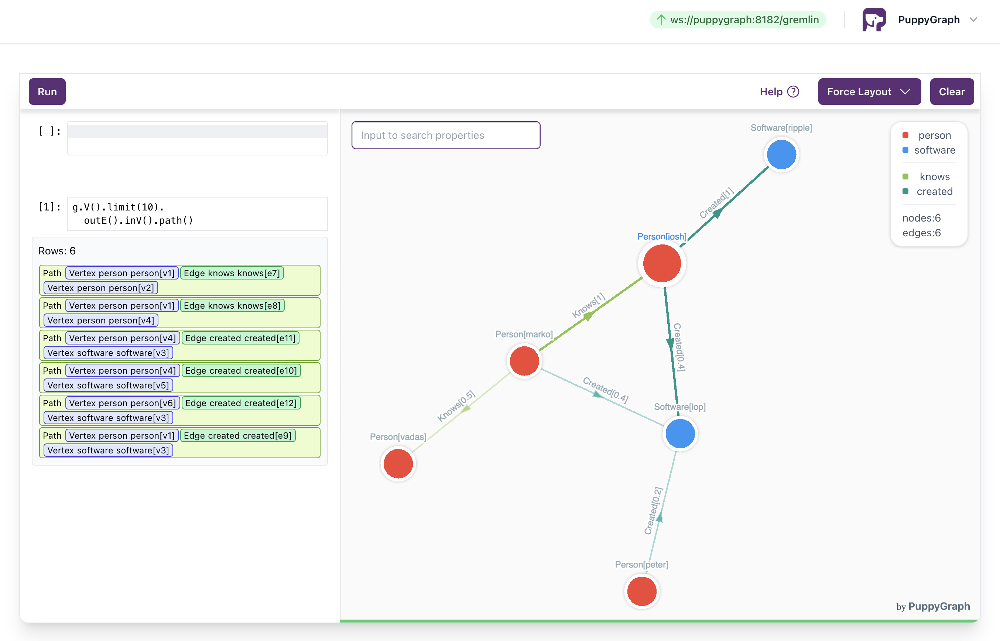

# PuppyGraph Query

PuppyGraph Query is a standalone web server that can connect to PuppyGraph or any compactible TinkerPop Gremlin server to visualize graph results from query results.



PuppyGraph Query is maintained by [PuppyGraph](https://www.puppygraph.com).

PuppyGraph Query is under Apache 2.0 license.

## Prerequisite

1. make
1. docker
1. docker compose (for testing)

## Build

Build docker image: `make docker`. The command will build a docker image `puppygraph/puppygraph-query:latest`.

## Usage

```docker run -d --rm -p 8081:8081 --name puppygraph-query -e PORT=8081 -e PUPPYGRAPH_USERNAME=puppygraph -e PUPPYGRAPH_PASSWORD=puppygraph123 -e GREMLINSERVER_HOST=<gremlin_server_host> puppygraph/puppygraph-query:latest```

Visit localhost:8081 and enter username/password to visit the UI.

### Use Gremlin Server username/password for authentication

If gremlin server requires authentication, enable USE_GREMLIN_AUTH=true, the server will use gremlin to validate the username and password for login.

Example:

```docker run -d --rm -p 8081:8081 --name puppygraph-query -e PORT=8081 -e USE_GREMLIN_AUTH=true -e GREMLINSERVER_HOST=<gremlin_server_host> puppygraph/puppygraph-query:latest```

### Other environment options

- `GREMLINSERVER_URL`: Override `GREMLINSERVER_HOST` and `GREMLINSERVER_PATH`, use the full URL. E.g. `GREMLINSERVER_URL=ws://127.0.0.1:8182/gremlin`
- `GREMLINSERVER_ALIAS`: Append a `{'aliases': {'key': 'value'}}` to the gremlin request. E.g. `key:value`
- `GREMLINSERVER_SKIPCERTVERIFY`: Skip the TLS token verification for testing. E.g. `GREMLINSERVER_SKIPCERTVERIFY=true`
- `HTTP_PROXY`: Proxy options from golang html library https://pkg.go.dev/net/http#ProxyFromEnvironment. E.g. `HTTP_PROXY=http://proxyIp:proxyPort`

## Test

```cd integrationtest/puppygraph && docker compose up```

The command will start docker and puppygraph, initialize puppygraph with a built-in "modern graph" and connect puppygraph query to it.

## Local build

To build and run the project locally.

1. Make sure golang (>=18) is installed on the local server.
```
curl -OL https://go.dev/dl/go1.20.7.linux-amd64.tar.gz
sudo tar -C /usr/local -xf go1.20.7.linux-amd64.tar.gz
```
Add `export PATH=$PATH:/usr/local/go/bin` to bashrc

2. Make sure you can run `npm run build` under the `html` folder to build the React app. Install nodejs. Use this: https://github.com/nodesource/distributions/blob/master/README.md. Make sure nodejs version is >= 20.
```
cd html
npm install
```

3. To build and run
```
make html build/server
PORT=8081 PUPPYGRAPH_USERNAME=puppygraph PUPPYGRAPH_PASSWORD=puppygraph123 GREMLINSERVER_HOST=<gremlin_server_host> build/server
```

## Features

1. **Run gremlin query and visualize the response**. Input your gremlin query on the left panel, the UI will automatically visualize the response based on the gremlin response type (vertices, edges, paths).
1. Queries are automatically stored in the browser localStorage.
1. Pick the graph **layout** between radial, vertical and force graph on the top right selector.
1. View the vertex and edge labels on the legend top-right. You can **change colors** for visualization by click the color rectangle on the legend.
1. Use mouse to **drag** on the canvas to move the view.
1. **Zoom**-in and out with mouse wheel on the canvas.
1. Use mouse to **drag and drop** any vertices to reposition them.
1. Left click on a vertex to **view the properties**.
1. Hover on a vertex and then left click on it's connected edge to **view the properties of an edge**.
1. Right click on a vertex to open the **action menu**:
    1. *Center* - Move the view to the vertex.
    1. *Query & view properties* - View the properties of the vertex.
    1. *Expand with edge label* - Pick or input an edge label, generate the query to expand one-hop from the given vertex, and add the results to the view.
    1. *Expand with all edge labels* - Generate the query to expand one-hop from the given vertex, and add all the results to the view.
1. Right click on the canvas to open the **graph action menu**:
    1. *Reset view* - Move the view to origin with default zooming.
    1. *Refresh layout* - Rerun the layout algorithm and automatically reposition the vertices.
    1. *Full screen* - Make the canvas display fullscreen.
    1. *Prefetch props and enable search* - Prefetch properties for all elements on the canvas and enable property search text box.
    1. *Scale to fit* - Automatically zoom-in or out the view to include as much content as possible.
    1. *Toggle labels* - Display labels for elements on the canvas.
    1. *Toogle grid* - Display grid on the canvas.
1. Property prefetch and related features
    1. To enable **search on properties**, right click on the canvas and make sure "Prefetch props and enable search" is selected. When it's enabled, the UI will automatically prefetch the properties in batches from the backend and gremlin server. Input search terms in the format like "id=1" or "code=LAX" to search the elements on the canvas.
    1. To **customize the label format**, right click on the canvas and make sure "Prefetch props and enable search" is selected. When it's enabled, click on the legend color edit panel a new text field will be displayed for label editing. Use a format string like `ID: {id}`, or `{code} - {city}` to render the properties as labels.
